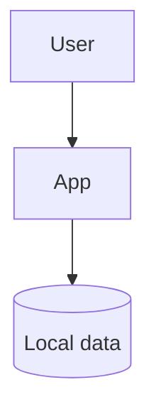

# Architecture

## Tech stack

_Check the components this project actually uses (done during project setup):_

- [ ] TypeScript (strict)
- [ ] Node.js LTS
- [ ] npm
- [ ] SQLite (better-sqlite3) for local data
- [ ] Vitest for tests
- [ ] ESLint (typescript-eslint strict type-checked)
- [ ] Other: ___

_Any deviation from the standard stack must be consciously confirmed by the user and noted under "Other" with a short reason._

## Component diagram

## Components

_Short description of each component: what it does and how it talks to the others._

| Component | What it does |
|---|---|
| _App_ | _..._ |
